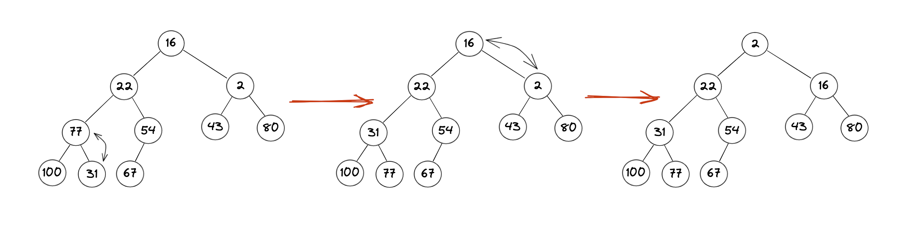
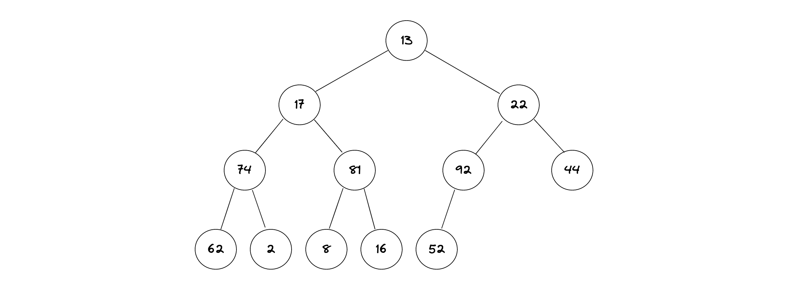

#### 7. Consider the following integers. 
| 6   | 12  | 2   | 77  | 54  | 43  | 80  | 100 | 31  | 67  |
| --- | --- | --- | --- | --- | --- | --- | --- | --- | --- |

#### (a) Draw a min heap from the above-mentioned numbers [15 pts]

Ans: 


#### (b) Put it in an array and write a method to add an element to the minheap and continue to maintain it as a minheap after addition [15 pts]
```js
import java.util.Arrays;

/**
 * This is Min Heap class. 
 */
public class MinHeap {

	//private helper variables. 
    private int[] heap;
    private int size;

	//Min Heap of size 10. 
    public MinHeap() {
        heap = new int[10];
        size = 0;
    }

	/**
	 * This add method takes the value to store it in the heap and set it properly. 
	 * @param value is the value to be added in the heap. 
	 */
    public void add(int value) {
		//When the heap is full. 
        if (size == heap.length) {
            heap = Arrays.copyOf(heap, heap.length * 2);
        }
		//Add the element to the last of the array. 
        heap[size++] = value;

		//Re-minheapify the heap. 
        bubbleUp(size - 1);
    }

	/**
	 * This will help to heapify the heap in min heap pattern. 
	 * @param index is the index of the node being added. 
	 */
    private void bubbleUp(int index) {
		//Getting the parent index. 
        int parentIndex = (index - 1) / 2;

		//This is doing the recursion. Index>0 is the stop point here for the recursion and index is decreasing as well. 
        if (index > 0 && heap[index] < heap[parentIndex]) {
            swap(index, parentIndex);
            bubbleUp(parentIndex);
        }
    }

	/**
	 * This method is to swap two nodes. 
	 * @param index1 is the index of the node. 
	 * @param index2 is the index of the parent node usually. It doesn't matter which one is the parent index though.
	 */
    private void swap(int index1, int index2) {
		//Saving the value of the index1 to the temp to save the data.
        int temp = heap[index1];
        heap[index1] = heap[index2];
        heap[index2] = temp;
    }

    @Override
    public String toString() {
        return Arrays.toString(Arrays.copyOf(heap, size));
    }


	//Main method to test the Class. 
    public static void main(String[] args) {

		//Creating a instance of MinHeap object defined in the class above and adding the data given to us. 
        MinHeap heap = new MinHeap();
        heap.add(16);
        heap.add(22);
        heap.add(2);
        heap.add(77);
        heap.add(54);
        heap.add(43);
        heap.add(80);
        heap.add(100);
        heap.add(31);
        heap.add(67);

		//Printing out the min heap. 
        System.out.println(heap);
    }
}
```

---
#### 8. Consider the following array of integers that represents a heap:
| 13  | 17  | 22  | 74  | 81  | 92  | 44  | 62  | 2   | 8   | 16  | 52  |
| --- | --- | --- | --- | --- | --- | --- | --- | --- | --- | --- | --- |

#### a) Draw a heap from the above-mentioned numbers, and specify which type of heap is it (min/max) and explain in 1 sentence why so [10 pts]  
Hint: Make first number the root(level 1), and then start adding the next set of numbers as nodes at each level(s), as discussed in class.




Ans: The given array can be classified neither as a min heap nor as a max heap as it does not satisfy neither property. In a min heap, the parent nodes are always smaller than their child nodes. But, if we look at the above tree, we can see 74 is parent node and yet have 2 at child node. Thus, that makes it not minheap. 
In max heap, the parent nodes are always greater than their child nodes. However, in the given array, 17 is parent node and yet have 74 at child node. Thus, that makes it not maxheap. 
## (b)  Write a method, isMinHeap(), that takes an array of integers as an argument and checks to if array represents a minheap, and returns true if the heap is minheap and false if otherwise [20 pts]
## (c) Test your method, once using an array that represents a minheap and once with an array that does not represent a minheap
Ans: 

```js
/**
 * Name: Sulav Jung Hamal
 * Class: 2023 Spring Sem CS220. 
 * Related To: Group Assignment 9
 * 
 * This is the min Heap class with the main function to test the isMinHeap() method that is described here. 
 * 
 */

public class MinHeapTest {

	/**
	 * This method check the given array is minheap or not. 
	 * @param arr is the array of values. 
	 * @return false if not minheap. True if minheap. 
	 */
	public static boolean isMinHeap(int[] arr) {
		// Length of the arry for the loop.
		int n = arr.length;

		// Looping through each index element upto the parent indexes.
		for (int i = 0; i <= (n / 2) - 1; i++) {

			// Calculating the left and right child of the parent indexes.
			int left = 2 * i + 1;
			int right = 2 * i + 2;

			// Checking if the left child is small than the parent. If so, it should return
			// false for minheap.
			if (left < n && arr[left] < arr[i]) {
				return false;
			}

			// Checking if the right child is small than the parent. If so, it should return
			// false for minheap.
			if (right < n && arr[right] < arr[i]) {
				return false;
			}
		}

		// if Everything ran through, than means the heap is minheap. Thus returning
		// true.
		return true;
	}

	// Main method to check the method that is created above.
	public static void main(String[] args) {
		int[] heap1 = { 13, 17, 22, 74, 81, 92, 44, 62, 2, 8, 16, 52 };
		int[] heap2 = { 2, 22, 16, 31, 54, 43, 80, 100, 77, 67};

		System.out.println(" ");
		System.out.println("Heap1 isMinHeap: ->" + isMinHeap(heap1));
		System.out.println("Heap2 isMinHeap: ->" + isMinHeap(heap2));
		System.out.println(" ");
	}

}
```
